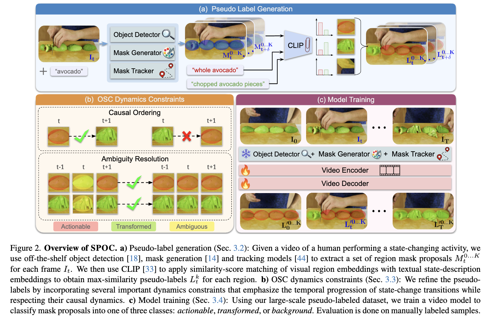
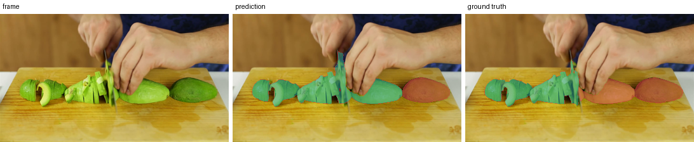
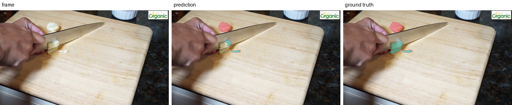

**All credit for the SPOC method and the WhereToChange benchmark belongs to the original authors:**

> Priyanka Mandikal, Tushar Nagarajan, Alex Stoken, Zihui Xue, Kristen Grauman. **SPOC: Spatially-Progressing Object State Change Segmentation in Video**. arXiv:2503.11953, 2025.

## Overview

See [my notes](notes.md) for more details.

This repo is an implementation of SPOC pseudo-labelling, including OSC dynamics constraints, for the WhereToChange benchmark. Labels object regions per frame as **actionable** (1, not yet changed) or **transformed** (2, changed).

[Paper](https://arxiv.org/abs/2503.11953) · [Dataset](https://github.com/priyankamandikal/spoc) · [Project page](https://vision.cs.utexas.edu/projects/spoc-spatially-progressing-osc/)

**Note**: no training/implementation of the SPOC video encoder-decoder transformer (part (c) below). To implement the transformer, we would need a seperate batch of videos from HowToChange/HowTo100M (paper's stated source) to avoid data leakage. After generating pseudo-labels and training the transformer on these pseudo-labeled masks, we then *evaluate* on WhereToChange.


*Figure 2 from Mandikal et al., SPOC (arXiv:2503.11953)*

## Pipeline
<!--
- `pseudolabel/proposals_modal.py` — stage 1 (Modal GPU): GroundingDINO + SAM + DeAOT -> masklet-ID masks per frame.
- `pseudolabel/label.py` — stages 2-3 (local): CLIP state scoring -> dynamics constraints -> painted masks.
- `pseudolabel/diagnose.py` — threshold grid / phrase / oracle diagnostics.
- `eval/evaluate_miou.py` — the paper's mIoU metric.
- `run_spoc_pl.sh` — driver: label + paint every OSC of a verb, then eval.
-->

```
video clip (5 fps)
  |
  v
[Stage 1 - Modal GPU - proposals_modal.py]
  GroundingDINO (detect noun, every 10 frames)
    -> SAM (32x32 point-grid masks, gated by boxes)
    -> DeAOT (track masklets between detections)
  |
  v
masklet-ID masks (palettized PNG, 1fps)
  |
  v
+--------------------------------------------------------------+
| run_spoc_pl.sh  (driver: loops over every OSC of a verb)     | 
|                                                              |
|  [Stages 2-3 - local - label.py]                             |
|    CLIP scoring (crop vs. actionable/transformed text)       |
|      -> raw labels (bg / amb / act / trf)                    |
|      -> dynamics constraints (causal order + ambiguity res.) |
|      -> painted masks (0=bg 1=act 2=trf)                     |
|    |                                                         |
|    v                                                         |
|  [eval/evaluate_miou.py]  <---  ground truth masks           |
|    mIoU vs ground truth        (data/WhereToChange)          |
+--------------------------------------------------------------+
                       |
                       v (cached scores + embeddings, outside run_spoc_pl.sh)
                 [pseudolabel/diagnose.py]
                  threshold grid / phrases / oracle diagnostics
```

## Usage

```sh
python -m venv .venv && source .venv/bin/activate
pip install -r requirements.txt

# 1. proposals (Modal GPU; data lives in the spoc-data volume)
modal run pseudolabel/proposals_modal.py::download_dataset   # once, populates the volume
modal volume get spoc-data data data/ --force                # pull WhereToChange locally (needed below)
modal run pseudolabel/proposals_modal.py --verb chopping --noun avocado

# 2-3 + eval (local; fetch proposals from the volume first)
modal volume get spoc-data outputs/proposals_v2 outputs/ --force
./run_spoc_pl.sh chopping

# diagnostics (threshold grid, phrase candidates, proposal oracle ceiling)
python pseudolabel/diagnose.py grid    --verb chopping --labels-root outputs/pl/WTC-HowTo
python pseudolabel/diagnose.py phrases --verb chopping --labels-root outputs/pl/WTC-HowTo
python pseudolabel/diagnose.py oracle  --verb chopping --props-root outputs/proposals_v2/WTC-HowTo
```

## Results (chopping, WTC-HowTo, 157 clips)

| Setup | mIoU |
|---|---|
| SPOC (PL), defaults | 0.277 |
| oracle (GT-best label per masklet) | 0.503 |
| paper: SPOC (PL) / oracle | 0.44-0.46 / 0.696 |

Frame / predicted mask / ground truth, red = actionable, green = transformed:




