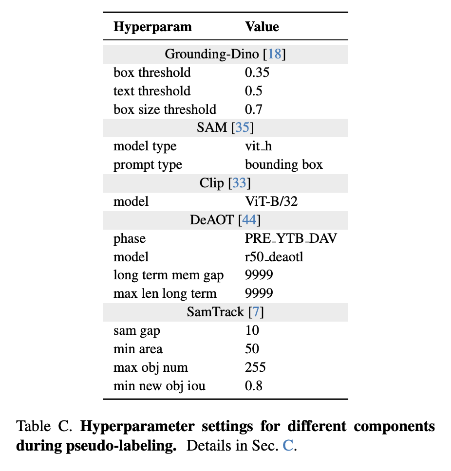
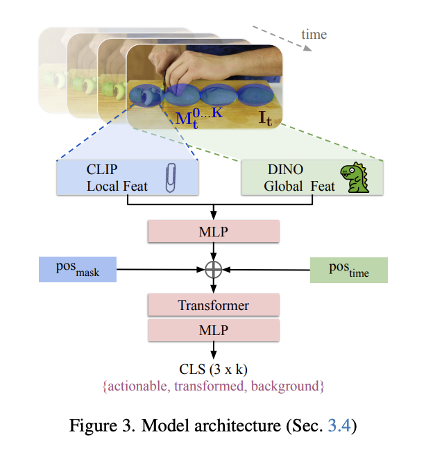

Takeaways for chefOST + paper summary

## Takeaways for chefOST

- Pseudo-labeling alone (CLIP similarity + causal-ordering/ambiguity-resolution, zero training) already beat every adapted baseline (mean mIoU 0.455 vs. 0.427 for GPT-4o), adding simple temporal constraints to the pretrained model pipeline was almost as impactful from training the SPOC video transformer (0.502)

- For the transformer, global + local features are both important - removing either DINOv2 (global) or CLIP (local) drops mIoU substantially (0.523 combined -> 0.423 global-only, 0.504 local-only, avg over chop/grate/peel).

- Currently a separate transformer must be trained for each verb - "generalizing to unseen actions would entail training an action-conditioned multi-task model, which we leave to future work"
  - Scalability limit
  - Moreover, this approach views the state-change trajectory of a verb as largely object-agnostic, which brings into question how well it can generalize to more unique object-specific actions like an egg scrambling
  - It also treats each state change as self-contained, but a real object's lifecycle in the real world is a chain of multiple such trajectories, i.e. in a single video an onion may be peeled then chopped then browned. Thus, a natural extension: a trajectory model that chains together these sequential OSCs, recognizing where each action starts/ends.

- Two failure modes mentioned (Sec F): (a) the detector outputs a single box spanning both actionable and transformed regions when they're too spatially close (e.g. hopping chive); (b) DeOAT loses object identity under fast/drastic transformation (e.g. melting butter) - an object needs level of structural stability needed for accuracy.
  - Root cause: currently, mask proposal and tracking with SAM/GroundingDINO/DeAOT is state-blind, i.e. GroundingDINO detects the noun only -> SAM proposes candidate masks -> DeOAT tracks, but these pretrained models have no notion of state. From the paper: "an exciting avenue to explore would be to predict mask proposals for actionable and transformed regions directly from the image... learning intra-object mask proposal end-to-end while also being sensitive to OSC dynamics over time." 

- Paper focuses on spatially-progressing OSCs (see paper summary below)

## Paper summary

Goal: "segment at the pixel-level those regions of an object that are actionable and those that are transformed". Formally, for each $I_t \in {I_1, ..., I_T}$, generate segmentation masks ${L_t^0, L_t^1, ..., L_t^K}$ for each object region and label as either actionable (1) or transformed (2).

Paper outputs
- Pipeline for pseudo-labelling videos with VLMs, generates weak labels sufficient for training. Includes novel dynamics constraints (causal ordering and ambiguity resolution)
- Video model to label mask proposals
- WhereToChange - first benchmark for spatially-progressing video OSC. Annotated OSC segmentations for 1162 videos spanning 210 state changes and 102 objects

Acronyms
- OSC = object state changes
- SPOC = spatially-progressing OSC segmentation. Not all OSCs are spatially progressing - define a spatially-progressing OSC as a state change that sequentially affects different regions of an object. Grating, peeling, shredding, painting but not grilling, frying, blending (state change occurs uniformly for whole object)

### Previous work
- OSC: classification, temporal segmentation, generation. HowToChange (VidOSC) - classification for unseen object categories. VOST, VSCOS - segmentation of **entire** object through video, this paper addresses state changes **within** objects
- Video object segmentation (VOS): seperate foreground objects from background at pixel level. Most work is semi-supervised VOS - given ground truth masks in first frame, track target objects. Some recent datasets consider state changes but at whole object level
- Open-vocab segmentation: Segment-Anything (SAM) is a segmentation model without a fixed label set. generalizes to object/images it hasn't seen before, promptable segmentation (user click, text prompt, etc). However falls short for state changes 
- Vision and language: Constrastive Language-Image Pretraining (CLIP) trained on image-text pairs to learn shared embedding space. SAM+CLIP - CLIP proposes, SAM segments OR SAM proposes, CLIP labels. However falls short for state changes  

Overall, minimal research for pixel-level segmentation of intra-object state changes


### Approach

Two parts: 1. pseudo-labelling, 2. video model

Both pseudo-labeling and the trained model aims to assign each mask one of three classes: actionable, transformed, or background
- Pseudo-labeling (Sec 3.2, 3.3): classify each mask proposal via CLIP similarity + CO/AR constraints. no learning involved.
- The trained model (Sec 3.4): given the same kind of mask proposals + video frames, the transformer decoder outputs a classification over {actionable, transformed, background} for each mask, learned from pseudo-labels as supervision.

The trained model is a lightwegith, 3-layer transformer encoder (512 hidden dim, 4 heads) + 1-layer MLP decoder, only 9.7M trainable parameters. For comparison: CLIP 88M, SAM 636M, DeAOT 49M. The main blocker: need to run pseudo-labelling on low thousands of clips for each verb to obtain training data. 


#### 1. Pseudo-labelling pipeline (this repo):
```
GroundingDINO → SAM → DeAOT           (stage 1: WHERE)
        |
        v
CLIP scoring (per masklet, per frame)  (stage 2: WHAT)
        |
        v
CO + AR (dynamics constraints)         (stage 3: CLEANUP)
        |
        v
painted masks (0/1/2)
```

Mask labelling:

$$
\hat{y}_t =
\begin{cases}
s_{bg}  & \text{if } S^t_{act} + S^t_{trf} < \tau \\
s_{amb} & \text{if } |S^t_{act} - S^t_{trf}| < \delta \\
s_{act} & \text{if } S^t_{act} > S^t_{trf} \\
s_{trf} & \text{if } S^t_{trf} > S^t_{act}
\end{cases}
$$

Causal ordering:

$$
\text{mid}_{act} = \frac{\sum_{t \in \mathbb{S}^k_{act}} t}{|\mathbb{S}^k_{act}|}, \qquad
\text{mid}_{trf} = \frac{\sum_{t \in \mathbb{S}^k_{trf}} t}{|\mathbb{S}^k_{trf}|}
$$

Ambiguity resolution:

$$
l_t^k =
\begin{cases}
s_{act} & \text{if } |t - \max(\mathbb{S}^k_{act})| < |t - \min(\mathbb{S}^k_{trf})| \\
s_{trf} & \text{otherwise}
\end{cases}
$$

Some important hyperparameters for the pretrained models:


#### 2. Trained video model (not in this repo)
For each frame $I_t$ and mask proposal $M_t^k$, combine local (CLIP, mask-level) and global (DINOv2, frame-level)
features with mask/time positional embeddings:

$$
z_t^k = \text{MLP}\big(\text{CLIP}(M_t^k) ,|, \text{DINOv2}(I_t)\big) + \text{pos}{mask}(k) + \text{pos}{time}(t)
$$

A transformer encoder attends over all ${z_t^k}$ in the clip, and an MLP decoder classifies
each token:

$$
\hat{y}t^k = \text{softmax}\big(\text{MLP}(\text{Transformer}({z_t^k})t^k)\big) \in {s{act}, s{trf}, s_{bg}}
$$

trained with cross-entropy loss against the pseudo-labels.



### WhereToChange

**Manually labelled ground truth (i.e. not pseudo-labelled by default, although we are pseudo-labelling it in this repo)**
- WTC-HowTo: 1,001 videos — frames + GT masks for all of them (complete, matches the eval split exactly).
- WTC-VOST: 261 videos have frames on disk, but only 155 (100 cut + 55 peel) have GT masks — the other 106 are raw frames from clips that got filtered out during annotation (motion blur, ambiguous states, etc., per the paper's curation process), so they're not usable for eval.
